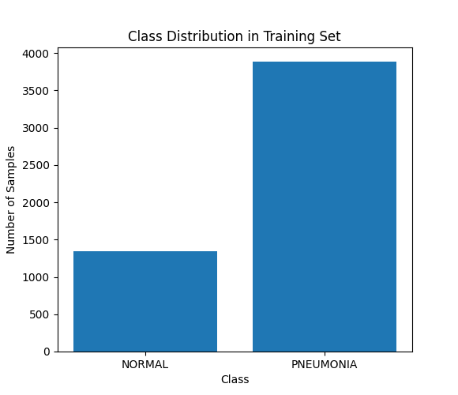
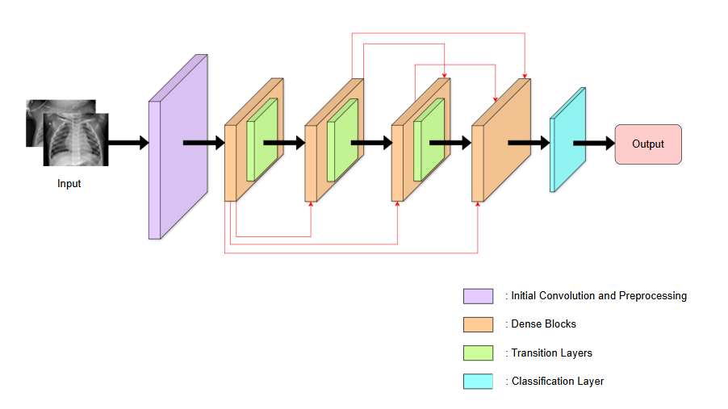

<!-- <div style="text-align: center; background-color: #8F98E3; font-family: 'Trebuchet MS', Arial, sans-serif; color: white; padding: 10px; font-size: 25px; font-weight: bold; border-radius: 0 0 0 0; box-shadow: 0px 6px 8px rgba(0, 0, 0, 0.2);">
  Pediatric Pneumonia Chest X-ray 🫁
</div> -->
# Pediatric Pneumonia Chest X-ray 🫁

#### 📖 <font color=red><b>Note that,</b></font> This **README** file is a step-by-step guide to setup. While there are some code snippets here, it is only a shorthand to illustrate what is in the file, so please do not copy the code in this file and put into your file to run, it can cause unwanted errors. </br>
<font color=yellow>Please strictly follow the instructions.</font>

### ⚙️ <font color=Gree><b>0.</b></font> <font color=Gree> Settings </font> </br>
First you need to install and add some necessary libraries for this project.

#### <font color=Purple><b><i> a) Requirements </i></b></font> 
- **seaborn** : ```pip install seaborn```
- **pytorch on CPU** : ```pip3 install torch==1.11.0+cpu torchvision==0.12.0+cpu -f https://download.pytorch.org/whl/torch_stable.html```
- **sklearn** : ```pip3 install scikit-learn```

#### <font color=Purple><b><i> b) Check Torch version </i></b></font> 
Make sure your versions of PyTorch and torchvision are compatible. You can refer to the official PyTorch compatibility table here</br>
| PyTorch Version    | torchvision Version |
| ------------------ | ------------------- |
| 2.0.0              | 0.15.0              |
| 1.13.1             | 0.14.1              |
| 1.12.0             | 0.13.0              |
| 1.11.0             | 0.12.0              |

The below code can be found in the file **"testTorch_ver.py**

```bash
import torch
import torchvision

print("PyTorch version:", torch.__version__)
print("torchvision version:", torchvision.__version__)
```

#### <font color=Purple><b><i> c) Import nescessary libraries </i></b></font> 

The below code can be found in the file <font color=Yellow><i> "libs.py" </i></font>

```bash
from sklearn.model_selection import train_test_split
from sklearn.metrics import confusion_matrix
import matplotlib.pyplot as plt

.
.
.

# Warnings off : Removes unnecessary warnings for a cleaner interface.
import warnings
warnings.filterwarnings("ignore")

# Fix a seed for PyTorch
torch.manual_seed(42);
```
Overview of the functionality of some libraries used:
- **scikit-learn** Helps us split the data into training and testing sets and evaluate the performance of the classification model.</br>

- **Graphing libraries** use 2 libraries <i>matplotlib</i> and <i>seaborn</i> to draw graphs to visualize the data</br>

- **PyTorch** 
    - **torch** : Build deep learning models, perform matrix and tensor operations on CPU/GPU.
    - **torch.nn** : Provides modules for building neural network layers.
    - **torch.optim** : Provides gradient descent optimization algorithms such as SGD, Adam, which help us update weights in deep learning models.
    - **torch.nn.functional** : Provides activation and loss functions as functions that we can use in the model if we don't want to call the nn layer.

- **torch.manual_seed(42)** : Set seed to ensure reproducible random results. Helps test and compare model runs.


### 🧮 <font color=Gree><b> 1. </b></font> <font color=Gree> Datasets </font> </br>

#### <font color=Purple><b><i> a) Abstract </i></b></font> 
The dataset is organized into two folders, **train** and **test**, and contains subfolders for each image category, **pneumonia** and **normal**.</br>
Overall, there are 5856 Chest X-rays labelled as either pneumonia or normal: 1583 normal (1349 for training, 234 for testing) and 4273 pneumonia (3883 for training, 390 for testing). </br>
Chest X-ray images were selected from <font color=Pink><b><i>Guangzhou Women and Children’s Medical Center, Guangzhou</i></b></font>. All chest X-ray imaging was performed as part of patients’ routine clinical care. For the analysis of chest X-ray images, all chest radiographs were initially screened for quality control by removing all low quality or unreadable scans. 

Link to this dataset:
https://www.kaggle.com/datasets/andrewmvd/pediatric-pneumonia-chest-xray

#### <font color=Purple><b><i> b) Data Evaluation </i></b></font>
However, as mentioned above, the two classes are not balanced. There are more examples for **PNEUMONIA** than **NORMAL**.

In order to properly train a neural network (but in general any classifier), the classes need to be balanced. Let me give some brief explanation for why this is:

- Suppose that a classifier needs to be able to distinguish event A from event B
- If the classifier is trained on some imbalanced data, say 99 events A and 1 event B, then it will always be convenient to predict event A (99% accuracy on the training data)
- This is why, when dealing with (strongly) imbalanced classes, as in this case, intervention is needed.

The code below will analyze the data of **PNEUMONIA** than **NORMAL** in the **"train"** set. You can find it in **"analyze_data"** function in <font color=Yellow><i> analyzeData.py </i></font> file.

```bash
def analyze_data(data_dir):
    ...

    # Count samples
    n_samples_nr_train = len(os.listdir(normal_train_dir))  
    n_samples_pn_train = len(os.listdir(pneumonia_train_dir))  

    # Define result
    class_count = {0: n_samples_nr_train, 1: n_samples_pn_train}
    class_names = {0: 'NORMAL', 1: 'PNEUMONIA'}

    ...

    plt.show()

    return class_count
```
, and the above code will return a comparison chart between the two classes. It'll look like this:
<center>
  
</center>
</br>

The classes are highly unbalanced, so it is necessary to balance them manually. In particular, in this project will be tested balancing via class weighting.

#### <font color=Purple><b><i> c) Solution : Weighted classes </i></b></font>

The approach I propose here is to train a neural network that associates each layer with a certain weight.<br>
Suppose we deal with the case of an event A (99 samples) vs. an event B (1 sample):
* if for an event A the classifier predicts an event B, the weight of the error will be $\hspace{2pt}\frac{1}{99+1}$
* if for an event B the classifier will predict an event A, the weight of the error will be $\hspace{2pt}\frac{99}{99+1}$

In this way for the classifier it will no longer be convenient, as it was previously, to classify everything as an A event.<br>
As already intuited, in this context, the weight for each class is calculated as:

$\qquad class\hspace{2pt}weight = 1 - \frac{number\hspace{2pt}of\hspace{2pt}samples\hspace{2pt}of\hspace{2pt}the\hspace{2pt}class}{total\hspace{2pt}numer\hspace{2pt}of\hspace{2pt}samples}$

The code implementing the above idea can be found in the **"class_weights"** function in the file <font color=Yellow><i> analyzeData.py </i></font>

```bash
def class_weights(class_count):
    ...

    samples_0 = class_count[0]
    samples_1 = class_count[1]
    tot_samples = samples_0 + samples_1

    # Calculate weights
    weight_0 = 1 - samples_0 / tot_samples
    weight_1 = 1 - weight_0  # equivalent to 1 - samples_1 / tot_samples

    ...
    return class_weights_tensor
```
, you will get the following result on the terminal :
```bash
Class weights: [0.7421636085626911, 0.25783639143730885]
```

### 📚 <font color=Gree><b> 2. </b></font> <font color=Gree> Pre-Training </font> </br>

```bash
Classes: ['NORMAL', 'PNEUMONIA']
Total images: 5232
Training set size: 3662
Validation set size: 1570
```


### 📓 <font color=Gree><b> 3. </b></font> <font color=Gree> Training </font> </br>

Put <font color=Red><b>"ChestX-Training.ipynb"</b></font> file into Google Collab, 
follow the installation instructions in that file, run it and display the results.

#### <font color=Purple><b> 3.1/ </b></font> <font color=Purple><b><i> Model </i></b></font> </br>

Model using in this project is DenseNet-161, now let's break down the structure of this model.

**Overall Architecture**

<br>
<center>
  
</center>
</br>

DenseNet-161 is a convolutional neural network (CNN) known for its dense connections between layers. It's characterized by:

*   **Initial Convolution:** A 7x7 convolution layer with stride 2, followed by a 3x3 max-pooling layer with stride 2. This reduces the original input size.
*   **Dense Blocks:**  DenseNet-161 has 4 Dense Blocks with the corresponding number of layers:
    *   Dense Layer 1: 6 layers
    *   Dense Layer 2: 12 layers
    *   Dense Layer 3: 36 layers
    *   Dense Layer 4: 24 layers

    Each layer in the Dense Block has the structure: Batch Normalization -> ReLU -> Convolution (1x1) -> Batch Normalization -> ReLU -> Convolution (3x3). And the growth rate (k) of DenseNet-161 is 48.
*   **Transition Layers:**  Between the Dense Blocks, each Transition Layer includes:
    *   Batch Normalization -> ReLU -> Convolution (1x1) (reduce the number of channels)
    *   2x2 Average Pooling with step 2 (reduce dimensionality)

*   **Classification Layer:** Fully Connected Layer with 1000 Outputs (for ImageNet classification problem with 1000 classes).

**Model Breakdown**

This's a summary for the DenseNet-161 model:

```bash
DenseNet-161

---------------------------------------------------------------------------------------------
      Layer (type)                  Input Shape              Output Shape           Param #
=============================================================================================
                                 [-1, 3, 224, 224]  
        Conv2d                   [-1, 3, 224, 224]        [-1, 96, 112, 112]        14,784
      BatchNorm2d                [-1, 96, 112, 112]       [-1, 96, 112, 112]          384
         ReLU                    [-1, 96, 112, 112]       [-1, 96, 112, 112]           0
       MaxPool2d                 [-1, 96, 112, 112]       [-1, 96, 56, 56]             0
---------------------------------------------------------------------------------------------
   _DenseBlock-1 (block-1)       [-1, 96, 56, 56]         [-1, 384, 56, 56]            0      
   _Transition-1 (trans-1)       [-1, 384, 56, 56]        [-1, 192, 28, 28]            0
---------------------------------------------------------------------------------------------
   _DenseBlock-2 (block-2)       [-1, 192, 28, 28]        [-1, 768, 28, 28]            0
   _Transition-2 (trans-2)       [-1, 768, 28, 28]        [-1, 384, 14, 14]            0
---------------------------------------------------------------------------------------------
   _DenseBlock-3 (block-3)       [-1, 384, 14, 14]        [-1, 2112, 14, 14]           0
   _Transition-3 (trans-3)       [-1, 2112, 14, 14]       [-1, 1056, 7, 7]             0
---------------------------------------------------------------------------------------------
   _DenseBlock-4 (block-4)       [-1, 1056, 7, 7]         [-1, 2208, 7, 7]             0
      BatchNorm2d                [-1, 2208, 7, 7]         [-1, 2208, 7, 7]           8,832
         ReLU                    [-1, 2208, 7, 7]         [-1, 2208, 7, 7]             0
---------------------------------------------------------------------------------------------
      Linear                     [-1, 2208, 7, 7]         [-1, 1000]               2,209,000
=============================================================================================
Total params: 28,681,000
Trainable params: 28,681,000
Non-trainable params: 0
---------------------------------------------------------------------------------------------
Input size (MB): 0.57
Forward/backward pass size (MB): 690.38
Params size (MB): 109.41
Estimated Total Size (MB): 800.36
---------------------------------------------------------------------------------------------
```

<font color=Yellow><b> Note: </b></font> you can see the detailed parameters of the layers of the denseNet blocks when declaring the model:
```bash
# Base model (transfer learning): DenseNet-161
# Transfer Learning
model = models.densenet161(pretrained=True)
model
```

#### <font color=Purple><b> 3.2/ </b></font> <font color=Purple><b><i> Fine-tuning </i></b></font> </br>

This section covers fine-tuning the pre-trained DenseNet-161 model, replacing the old (linear) classifier with a new classifier suitable for this project.

* First, we will extract the properties of the pre-trained model. We will use **Transfer Learning** - a technique that takes a model that has been trained on a large dataset (in the case of DenseNet-161 is ImageNet) and applies it to a new problem, usually a smaller dataset. The idea is that the model has learned useful features from the large dataset, and these features can be reused for the new problem.

```bash
# Important: compatibility problem
# Whatever classifier we put, it will have to have 'model.classifier.in_features' as 'in_features'
model.classifier.in_features
```
  This line accesses the **in_features** property of the current classifier of the model (DenseNet-161). This property indicates the number of input features of the classifier. In DenseNet-161 trained on ImageNet, the classifier is a Linear (fully connected) layer with **in_features=2208**.

  Note: The two comments emphasize that any new classifier that replaces it must have the same number of in_features as the old classifier (here 2208 - see the Model Summary above). This is important to ensure size compatibility between the output of the feature extractor and the input of the new classifier.

* However, here we are only tweaking to suit the project, not changing the architecture of the model learned from the ImageNet dataset. We will freeze all the weights of the pre-trained model, including the feature extraction and the initial classification layer.

```bash
# Freeze the weights of the pre-trained model
for parameter in model.parameters():
    parameter.requires_grad = False
```
The for loop will iterate through each parameter and set the **requires_grad** attribute (to decide whether a parameter is updated during backpropagation) to **False** so that the parameter will be frozen, not changing its value during training.

* Next, we will build a new classification layer with the input parameter **(in_features)** of the old classification layer (2208) and save it in the variable **initial_num_neurons** , and the output parameter is 2 (NORMAL and PNEUMONIA), taken from the previously defined dictionary **class_index** and saved in the variable **num_classes**. Then proceed to replace the old classification layer of the model with the newly created classification layer.

```bash
# Build a custom classifier
initial_num_neurons = model.classifier.in_features
num_classes = len(class_index)
classifier = nn.Linear(in_features=initial_num_neurons, out_features=num_classes)
model.classifier = classifier
```

* Loss Function: The loss function used here is <font color=Yellow><b> Multiclass Cross Entropy Loss </b></font>, a variant of Cross Entropy Loss - a 
popular loss function used in classification problems. Let's talk a little about this function:</br>
Multiclass Cross Entropy Loss, also known as **Categorical cross entropy loss** or **Softmax loss**. 
For a dataset with N instances, the Multiclass Cross Entropy Loss is calculated as follows:

$$
-\frac{1}{N}\Sigma_{i=1}^N\Sigma_{j=1}^C(y_{i,j}.log(p_{i,j}))
$$

where:</br>
     - C is the number of classes.</br>
     - yi,j are the true labels for class j for instance i</br>
     - pi,j is the predicted probability for class j for instance i</br>

```bash
loss_function = nn.CrossEntropyLoss(weight=class_weights.to(device))
```
And if you remember, I have already given a solution to the imbalanced data using a **weight**. 
And now I will implement the class weights in the model by adjusting the loss function to incorporate
the class weights during the model compilation. 
Most machine learning libraries support this functionality - and PyTorch is no exception.

The **nn.CrossEntropyLoss** function allows the user to use the **weight** parameter to assign different weights to each class. 
This is useful for our imbalanced dataset, where the number of samples between classes is very different. 
By assigning a larger weight to the minority class, you will "penalize" the model more for incorrectly predicting samples in that class, 
helping the model learn better on the minority class.

The class weight i have calculated in the mentioned above is:
```bash
Class weights: tensor([0.7422, 0.2578])
```
,means that the NORMAL class has weight 0.7422 and the PNEUMONIA class has weight 0.2578.
The NORMAL class (minority) has weight larger than PNEUMONIA (majority). 
And **.to(device)** is just to make sure that **class_weights** and the model are on the same device, 
avoiding errors during calculation.


